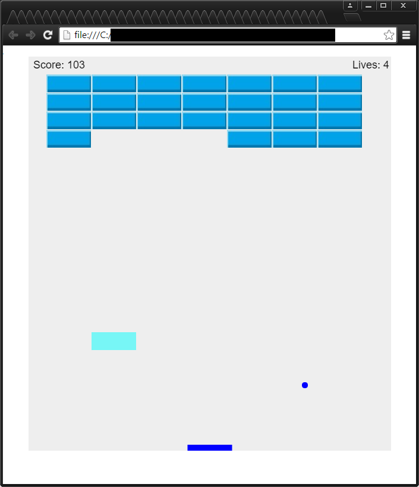

# Breakout
Arcade Style Breakout Game 

This was written almost entirely in JavaScript, with some HTML. It started out as a tutorial from https://developer.mozilla.org/en-US/docs/Games/Tutorials/2D_Breakout_game_pure_JavaScript, but I refactored code, implimented an object oriented approach, made gameplay more random, allowed the canvas to determine correct size based on browser window size, and added bonus items when the user breaks bricks as a new feature. This demonstrates my ability to read and improve existing code.

